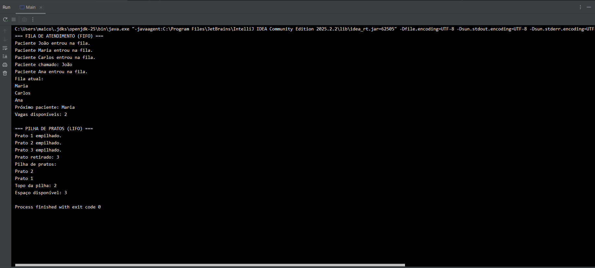

# 📚 Estruturas de Dados em Java (FIFO e LIFO)

Este projeto foi desenvolvido com o objetivo de praticar conceitos fundamentais de estruturas de dados utilizando Java.

---

## 🚀 Conceitos abordados

- 🔹 FIFO (First In, First Out) — Fila
- 🔹 LIFO (Last In, First Out) — Pilha

---

## 💻 Tecnologias utilizadas

- Java
- Programação Orientada a Objetos (POO)

---

## 📂 Estrutura do projeto

- `Main.java` → Classe principal para execução
- `FilaAtendimento.java` → Implementação de fila (FIFO)
- `PilhaPratos.java` → Implementação de pilha (LIFO)

---

## ⚙️ Funcionalidades

### 📋 Fila (FIFO)
- Inserir paciente
- Chamar paciente
- Visualizar fila
- Ver próximo paciente
- Consultar vagas disponíveis

### 🍽️ Pilha (LIFO)
- Empilhar pratos
- Retirar prato
- Visualizar pilha
- Ver topo da pilha
- Consultar espaço disponível

---

## ▶️ Como executar

1. Clone o repositório:

git clone https://github.com/SEU-USUARIO/estruturas-de-dados-java.git

2. Abra o projeto em uma IDE (IntelliJ, Eclipse, VS Code)

3. Execute a classe `Main.java`

---

## 🎯 Objetivo

Praticar lógica de programação e compreender o funcionamento de estruturas de dados fundamentais na computação.

---

## 👨‍💻 Autor

Desenvolvedor em formação 🚀

## 📸 Exemplo de execução

